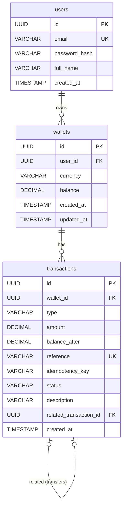

# Database Schema Documentation

This document outlines the relational database schema for the Fintech Payment API. The schema is defined by the JPA/Hibernate entity models.

## Tables

### 1. `users`
Stores user profile information and credentials.

| Column | Type | Constraints | Description |
| :--- | :--- | :--- | :--- |
| `id` | UUID | Primary Key | Unique identifier for the user. |
| `email` | VARCHAR(255) | Not Null, Unique | User's email address, used for login. |
| `password_hash` | VARCHAR(255) | Not Null | Securely hashed password. |
| `full_name` | VARCHAR(255) | Not Null | User's full name. |
| `created_at` | TIMESTAMP | Not Null | Record creation timestamp. |

### 2. `wallets`
Stores the wallets associated with users for holding funds in specific currencies.

| Column | Type | Constraints | Description |
| :--- | :--- | :--- | :--- |
| `id` | UUID | Primary Key | Unique identifier for the wallet. |
| `user_id` | UUID | Not Null, FK to `users` | The owner of the wallet. |
| `currency` | VARCHAR(3) | Not Null | The currency code (e.g., USD, EUR). |
| `balance` | DECIMAL(19, 4) | Not Null, Default 0 | The current balance in the wallet. |
| `created_at` | TIMESTAMP | Not Null | Record creation timestamp. |
| `updated_at` | TIMESTAMP | Not Null | Timestamp of the last balance update. |

**Constraints & Indexes:**
- **Unique Constraint (`uk_wallet_user_currency`)**: Ensures a user can only have one wallet per currency (`user_id`, `currency`).
- **Index (`idx_wallet_user_currency`)**: Index on `(user_id, currency)` to optimize concurrent read performance.

### 3. `transactions`
Provides an immutable ledger of all money movements (deposits, transfers) affecting wallets.

| Column | Type | Constraints | Description |
| :--- | :--- | :--- | :--- |
| `id` | UUID | Primary Key | Unique identifier for the transaction. |
| `wallet_id` | UUID | Not Null, FK to `wallets` | The wallet this transaction affects. |
| `type` | VARCHAR(10) | Not Null | The type of transaction (`DEPOSIT`, `TRANSFER`). |
| `amount` | DECIMAL(19, 4) | Not Null | The amount of the transaction. |
| `balance_after` | DECIMAL(19, 4) | Not Null | The wallet's balance after this transaction. |
| `reference` | VARCHAR(255) | Not Null, Unique | External reference ID for tracking. |
| `idempotency_key` | VARCHAR(255) | Nullable | Key to prevent duplicate processing. |
| `status` | VARCHAR(255) | Nullable | State of the transaction (e.g., `COMPLETED`). |
| `description` | VARCHAR(255) | Nullable | Optional description or memo. |
| `related_transaction_id`| UUID | Nullable, FK to `transactions`| Links the debit/credit sides of a transfer. |
| `created_at` | TIMESTAMP | Not Null | Record creation timestamp. |

**Constraints & Indexes:**
- **Composite Index (`idx_tx_wallet_created`)**: Composite index on `(wallet_id, created_at DESC)` to optimize paginated transaction history lookups.
- **Index (`idx_tx_reference`)**: Index on `(reference)` to optimize fast transactional lookup and idempotency verification.

## Relationships

